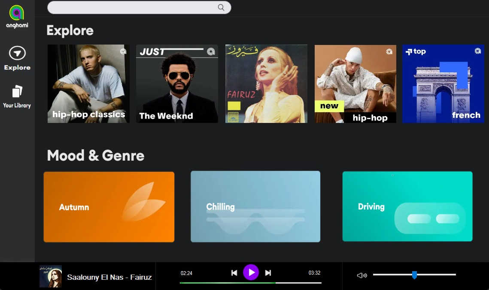
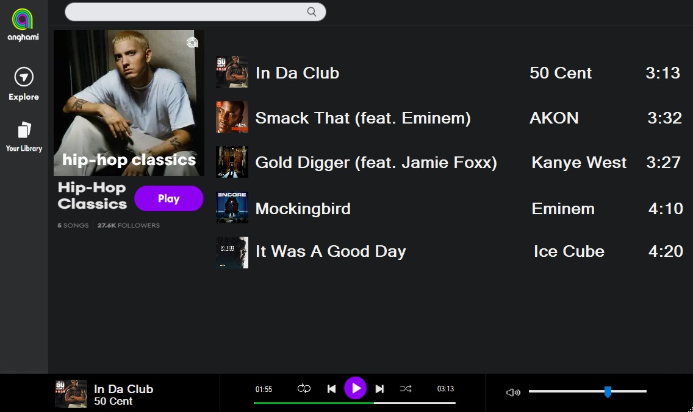
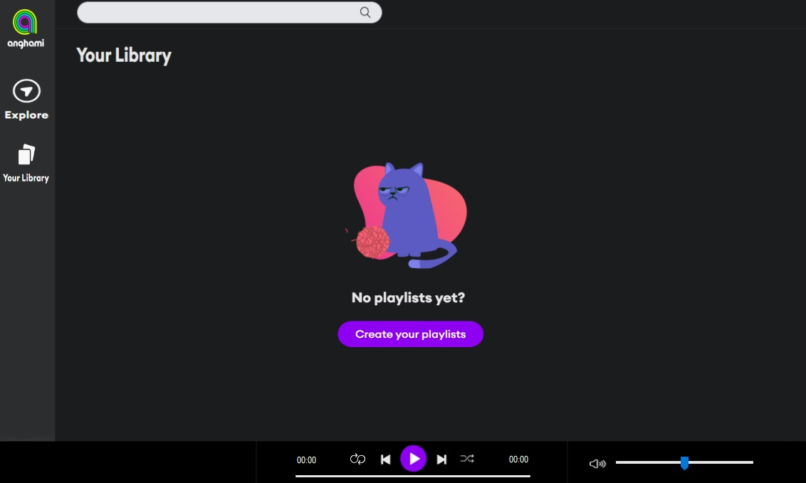

# Anghami Clone

Anghami Clone is a music player application developed as a project for the CS213 Data Structures course. It mimics the layout and features of the popular Middle Eastern music streaming platform Anghami.

## Installation

1. Clone the repository.
2. Compile the source code using a C++ compiler (preferably Visual Studio 2022).
3. Run the executable file generated.

## Usage

- Navigate the homepage to access pre-made playlists.
- Select playlists to view tracks and play songs.
- Control playback using options like repeat, skip, and shuffle.
- Create custom playlists from the library of available music tracks.

## Technologies Used

- C++ for backend logic
- Windows Forms for the graphical user interface

## Implementation Details

The project utilizes linked lists, queues, and stacks as the backbone data structures. These are used to manage playlists, tracks, and playback options effectively.

#### Homepage:

#### Playlist:

#### Custom playlist menu:

## Contribution
Our team:
  - [@RamzyBakir](https://github.com/RamzyBakir)
  - [@YahiaSonbol](https://github.com/YahiaSonbol)
  - [@medo3alaa](https://github.com/medo3alaa)
  - @YoussefHazem
  - @OmarElBayoumi
## Credits

- [Anghami](https://www.anghami.com/) - Inspiration for the project layout and features.

## Contact Us

For any questions or feedback, feel free to reach out to us at [ramzybakir.rsb@gmail.com](ramzybakir.rsb@gmail.com), [yahiasonbol@gmail.com](yahiasonbol@gmail.com).
